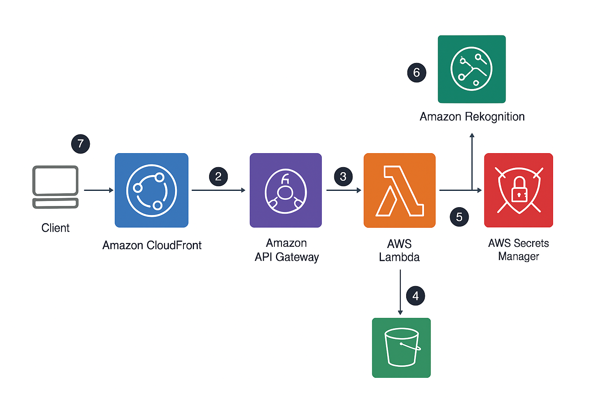

# Medica-template-Angular
# 🏥 Medical Image Services on AWS

A serverless, cost-efficient, and secure image processing system for a medical services website. This solution enables dynamic image transformation using AWS services like S3, Lambda, EC2, IAM, CloudFront, and more, delivering scalable and optimized media content for web and mobile applications.

## 🚀 Solution Overview

This project is built around the **Dynamic Image Transformation for Amazon CloudFront** solution to process and serve medical images efficiently. It uses the **Sharp** image library for fast, high-quality manipulation of images such as resizing, formatting, and watermarking.

The system is designed to:
- Automatically handle image uploads.
- Dynamically transform and optimize images on-the-fly.
- Deliver cached content globally using CloudFront.
- Minimize operational overhead using a fully serverless architecture.

## 🖼️ Architecture

### Core Features:
- **Serverless Architecture**: Eliminates the need for server management.
- **Event-Driven**: Images uploaded to S3 trigger Lambda functions for real-time processing.
- **Dynamic Image Processing**: Images are resized or transformed based on screen size or request parameters.

### Architecture Components:
- **Amazon S3**: Stores both original and processed images.
- **AWS Lambda**: Processes and transforms images on-the-fly.
- **Amazon CloudFront**: Caches and globally delivers images with low latency.
- **Amazon API Gateway (Optional)**: Provides API endpoints for uploading or requesting images.
- **Amazon DynamoDB (Optional)**: Stores metadata (e.g., uploader, timestamps).
- **AWS Step Functions (Optional)**: Orchestrates complex workflows.
- **IAM**: Manages secure roles and access control policies for all services.
- **Amazon EC2**: Hosts additional backend components or monitoring tools (if needed).

## 📌 Key Features

- ✅ Dynamic image resizing and transformation.
- ✅ High-speed, low-cost image delivery using CloudFront.
- ✅ Fully serverless and scalable.
- ✅ Secure with fine-grained IAM permissions and S3 bucket policies.
- ✅ Optional API and metadata storage integration.

## 🧠 Learning Outcomes

- Building **event-driven** architectures using S3 and Lambda.
- Designing **scalable serverless systems** on AWS.
- Implementing **secure access control** with IAM.
- Deploying and managing **CloudFront distributions** for global delivery.
- Managing image lifecycle, from upload to transformation and delivery.

